# Modbus Aware Firewall


**Modbus Aware Firewall** er en passiv OT-sikkerhedsmonitoreringsprototype til Modbus TCP-miljøer. Systemet observerer spejlet industriel netværkstrafik, udtrækker Modbus-kontekst, gemmer operationel state i PostgreSQL og præsenterer enheder, forbindelser, registeraktivitet, latency og alarmer i et webdashboard.

Projektet er designet til mindre lab- og OT-miljøer, hvor ældre Modbus TCP-udstyr stadig anvendes, og hvor der er behov for indsigt i master/slave-kommunikation uden straks at ændre produktionsnetværkets datapath.

<p align="center">
  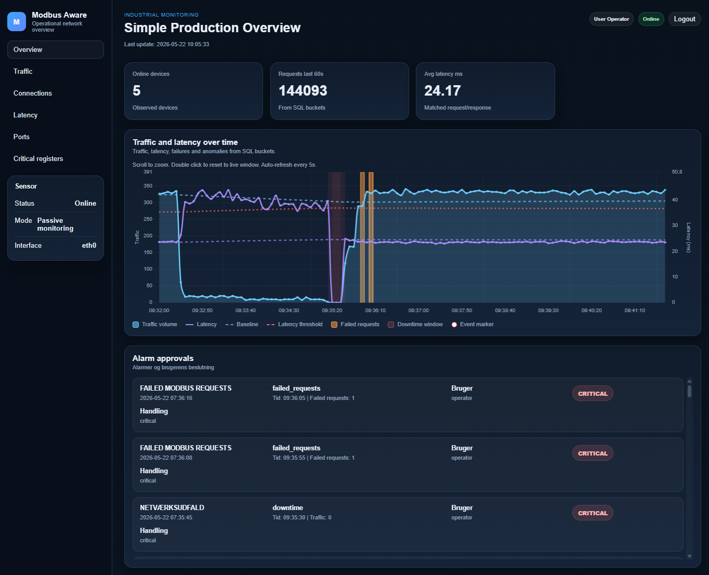
</p>

> På trods af repository-navnet er den nuværende implementering primært en passiv IDS- og monitoreringsløsning. Den observerer, detekterer og understøtter operatørbeslutninger. Den dropper ikke pakker inline og håndhæver ikke direkte netværksblokering.

---

## Indholdsfortegnelse

- [Formål](#formål)
- [Kernefunktioner](#kernefunktioner)
- [Arkitektur](#arkitektur)
- [Detektionsmodel](#detektionsmodel)
- [Data gemt i PostgreSQL](#data-gemt-i-postgresql)
- [Teknologistak](#teknologistak)
- [Repository-struktur](#repository-struktur)
- [Krav](#krav)
- [Hurtig start](#hurtig-start)
- [Konfiguration](#konfiguration)
- [Dashboard](#dashboard)
- [API-overblik](#api-overblik)
- [Driftsnoter](#driftsnoter)
- [Sikkerhedsnoter](#sikkerhedsnoter)
- [Kendte begrænsninger](#kendte-begrænsninger)
- [Fejlsøgning](#fejlsøgning)
- [Roadmap](#roadmap)
- [Licens](#licens)

---

## Formål

Modbus TCP er udbredt i industrielle miljøer, men protokollen tilbyder ikke i sig selv autentifikation, kryptering eller kommandoautorisation. En enhed på samme netværkssegment kan derfor observere, replaye eller manipulere trafik, hvis de omkringliggende netværkskontroller er svage.

Dette projekt adresserer dette synlighedsproblem ved passivt at overvåge Modbus TCP-trafik og skabe kontekst omkring:

- hvilke enheder der findes på netværket
- hvilke enheder der opfører sig som Modbus-mastere eller -slaver
- hvilke master/slave-relationer der findes
- hvilke Modbus function codes der anvendes
- hvilke registre og coils der skrives til
- om registerværdier ændrer sig uventet
- om request/response-latency ændrer sig
- om requests timer ud eller returnerer exception responses
- om IP/MAC-identitetsændringer kan indikere ARP spoofing eller MITM-aktivitet
- om switch-porte bliver aktive, og hvilke enheder der kan kobles til dem

Målet er ikke at erstatte kommercielle OT-sikkerhedsplatforme. Målet er at levere en fokuseret, forståelig og inspicerbar sikkerhedsmonitor til Modbus TCP-trafik.

<p align="center">
  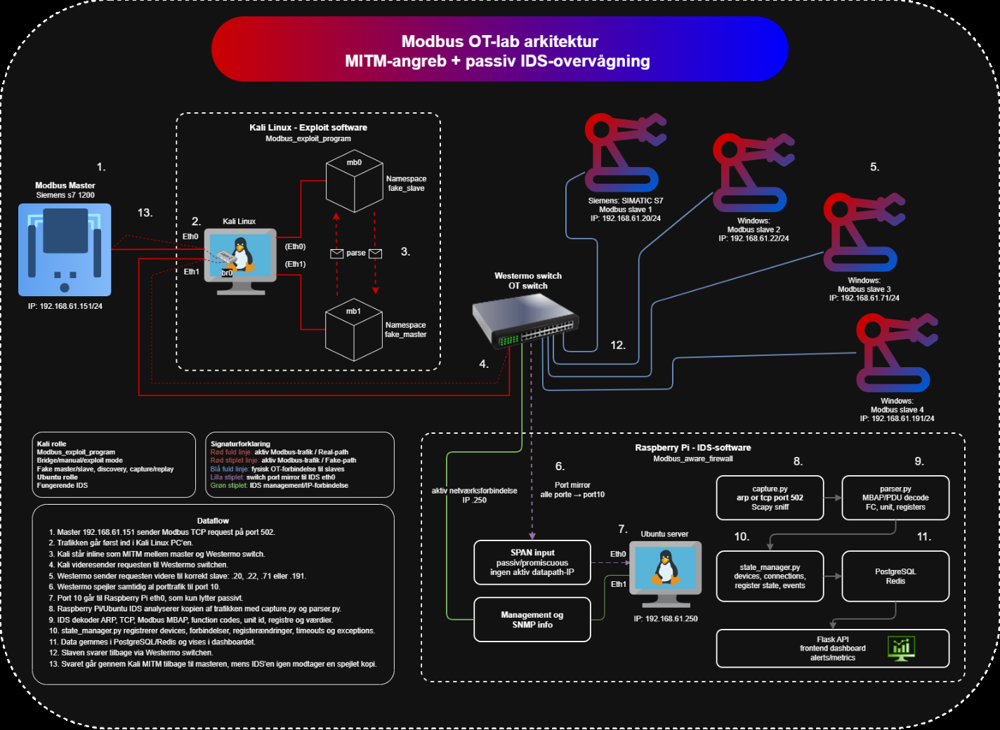
</p>

---

## Kernefunktioner

### Passiv packet capture

Backenden bruger Scapy til at sniffe trafik fra et konfigureret netværksinterface. Som standard captures:

```text
arp or tcp port 502
```

Det holder capture-scope fokuseret på ARP-observationer og Modbus TCP-trafik.

### Modbus TCP-parsing

Packet parseren udtrækker Ethernet-, ARP-, IP-, TCP- og Modbus TCP-felter. For Modbus-trafik parses MBAP-headeren og understøttede Modbus function codes.

Understøttede function codes:

| Function code | Modbus-operation | Registertype |
| --- | --- | --- |
| 1 | Read Coils | coil |
| 2 | Read Discrete Inputs | discrete_input |
| 3 | Read Holding Registers | holding_register |
| 4 | Read Input Registers | input_register |
| 5 | Write Single Coil | coil |
| 6 | Write Single Register | holding_register |
| 15 | Write Multiple Coils | coil |
| 16 | Write Multiple Registers | holding_register |

### Device- og rolletracking

Systemet vedligeholder et databaseunderstøttet inventory over observerede enheder. Enheder kan klassificeres som:

- `master`
- `slave`
- `unknown`

ARP-observationer opretter ukendte enheder. Modbus request-retning bruges til at udlede master- og slave-roller.

### Master/slave-forbindelsestracking

Observerede Modbus-relationer gemmes som:

```text
master_ip -> slave_ip -> unit_id
```

Dashboardet grupperer relationerne efter master og viser de tilknyttede slaver.

### Register-state tracking

Write-operationer spores på registerniveau. Backenden gemmer den senest observerede værdi for hver:

```text
slave_ip + unit_id + register_type + register_address
```

Registerværdiændringer kan generere events, især når registeret er konfigureret som kritisk.

### Kritisk register-policy

Operatører kan definere kritiske registre fra dashboardet. En kritisk registerregel kan indeholde:

- slave-IP
- Modbus unit ID
- registertype
- registeradresse
- menneskeligt læsbart label
- tilladte værdier
- pin-on-change-adfærd

Det gør det muligt for systemet at fremhæve vigtige writes, eksempelvis ændringer i sikkerhedsrelevante coils eller holding registers.

<p align="center">
  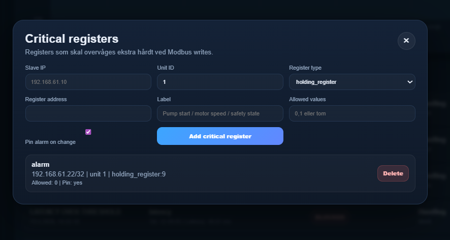
</p>

### Latency- og timeoutmonitorering

Backenden matcher Modbus requests og responses ved hjælp af transaction ID, unit ID og source/destination-IP-kontekst. Den beregner latency og detekterer:

- høj latency
- manglende responses
- request timeouts
- Modbus exception responses
- failed request buckets
- downtime-vinduer, hvor der ikke ses Modbus-trafik

### ARP- og identitetsændringsdetektion

Systemet observerer IP/MAC-relationer og kan oprette events, når en kendt IP-adresse ses med en anden MAC-adresse. Det er relevant til at opdage mistænkelig adfærd såsom ARP spoofing, MITM-positionering eller uventet udskiftning af netværksenheder.

<p align="center">
  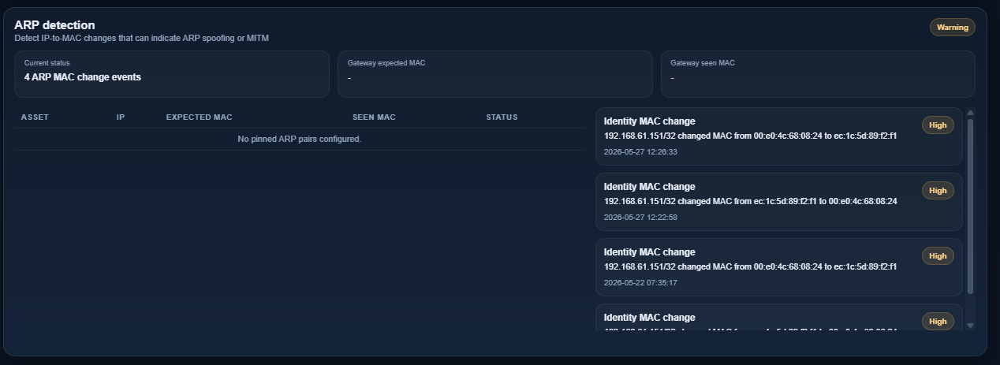
</p>

### Alarm approvals

Operatører kan håndtere alarmer direkte i dashboardet. Beslutninger gemmes i PostgreSQL og kobles tilbage til den oprindelige event.

Understøttede handlinger:

- approve
- block
- ignore
- mark as critical

Den nuværende implementering registrerer beslutningen. Den håndhæver ikke netværksblokering.

<p align="center">
  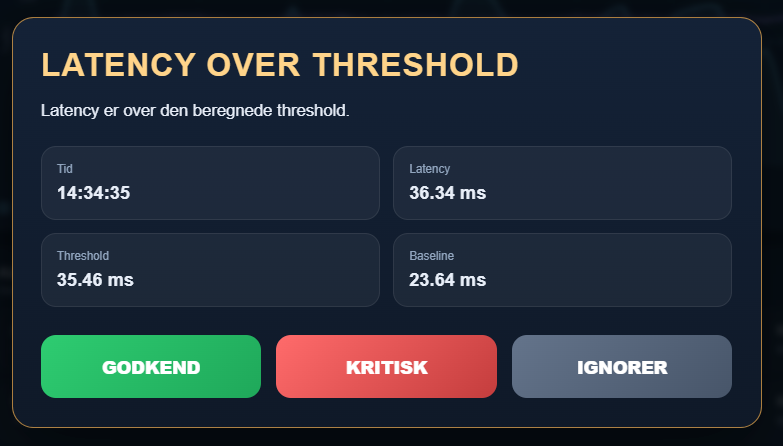
</p>

### Westermo switch-synlighed via SNMP

Backenden kan forespørge en switch via SNMP for at berige dashboardet med fysisk portinformation. Den læser interface-state, hastighed, forwarding database entries og MAC-to-port mappings.

Det gør det muligt for dashboardet at vise aktive porte og, hvor det er muligt, mappe kendte enheder til fysiske switch-porte.

<p align="center">
  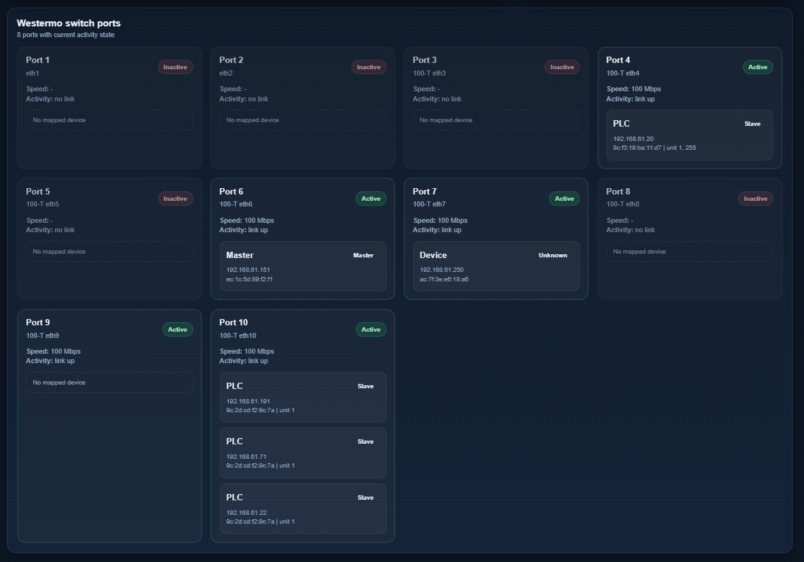
</p>

---

## Arkitektur

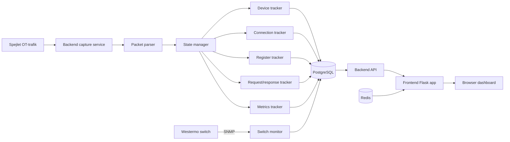

<p align="center">
  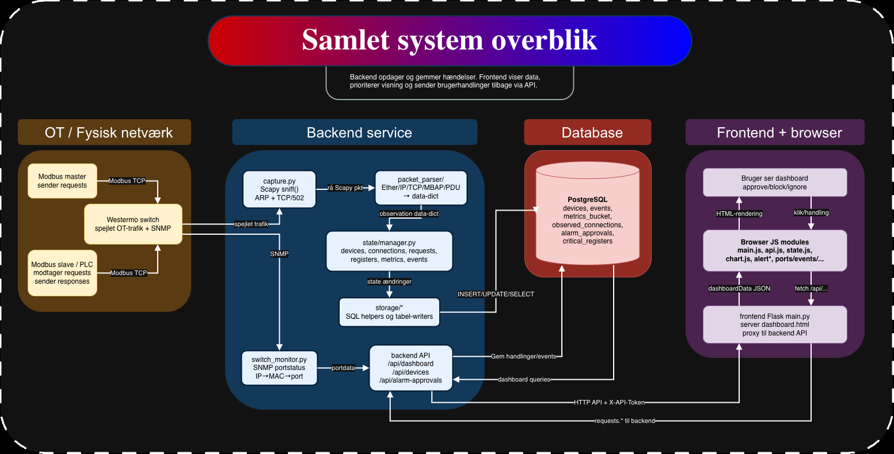
</p>

### Backend-flow

```text
capture.py
  -> packet_parser/parser.py
  -> state/manager.py
  -> state trackers
  -> storage layer
  -> PostgreSQL
```

<p align="center">
  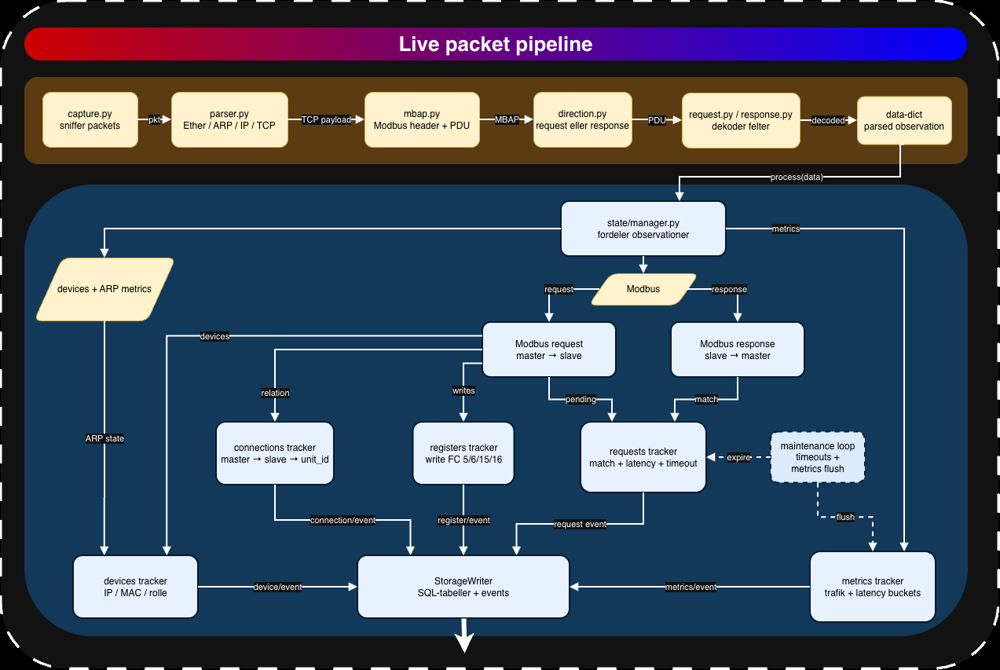
</p>

<p align="center">
  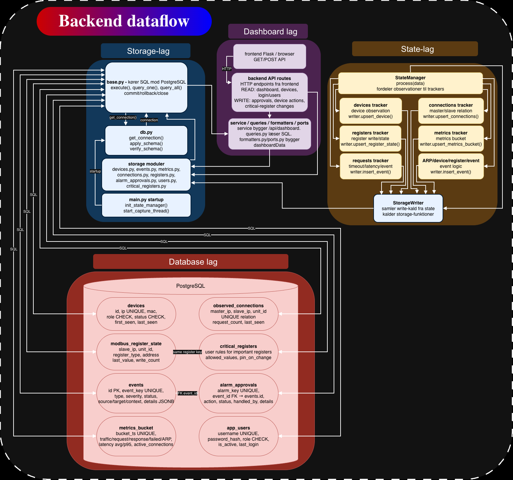
</p>

### Frontend-flow

```text
Browser
  -> frontend Flask app
  -> backend API med X-API-Token
  -> PostgreSQL-baseret dashboarddata
  -> browser dashboard refresh
```

---

## Detektionsmodel

Systemet bruger et learning window efter startup. I denne periode behandles observerede enheder, forbindelser og function codes som baseline-trafik. Efter learning window kan nye eller ændrede observationer generere events.

Standard learning window:

```text
300 seconds
```

Primære eventtyper:

| Event type | Betydning | Typisk severity |
| --- | --- | --- |
| `new_device` | En ny IP/MAC-enhed observeres efter learning mode | info |
| `identity_mac_changed` | En kendt IP observeres med en anden MAC-adresse | high |
| `identity_role_changed` | En enhed skifter mellem master- og slave-rolle | high |
| `new_connection` | En ny master/slave/unit-relation observeres | info |
| `new_function_code` | En ny Modbus function code bruges mod en slave/unit | info |
| `new_register_observed` | Et skrevet register observeres første gang | info/high/critical |
| `register_value_changed` | Et kendt register ændrer værdi | medium/high/critical |
| `latency_spike` | Request/response-latency overstiger grænseværdien | medium |
| `request_timeout` | Ingen response observeres før timeout | high |
| `exception_response` | En Modbus exception response observeres | high |
| `downtime` | Ingen Modbus-trafik ses i et metrics bucket | high |
| `failed_requests` | Failed requests findes i et metrics bucket | high |
| `port_active` | En switch-port er aktiv | medium |

---

## Data gemt i PostgreSQL

Projektet gemmer operationel state, dashboarddata og operatørbeslutninger i PostgreSQL.

| Tabel | Formål |
| --- | --- |
| `devices` | Observerede IP/MAC-enheder, rolle, status og first/last seen-timestamps |
| `observed_connections` | Master/slave/unit-relationer og request counts |
| `modbus_register_state` | Seneste kendte værdi for observerede Modbus coils/registers |
| `events` | IDS-events, severity, status, source/target-kontekst og JSON-detaljer |
| `metrics_bucket` | Aggregeret trafik, requests, responses, failures, ARP og latency-metrics |
| `critical_registers` | Operatørdefinerede kritiske registerregler |
| `app_users` | Dashboardbrugere, password hashes, roller og login-state |
| `alarm_approvals` | Operatørbeslutninger på alarmer, koblet til events |

Systemet gemmer aggregerede observationer og sikkerhedsrelevant state. Det gemmer ikke alle rå pakker i databasen.

<p align="center">
  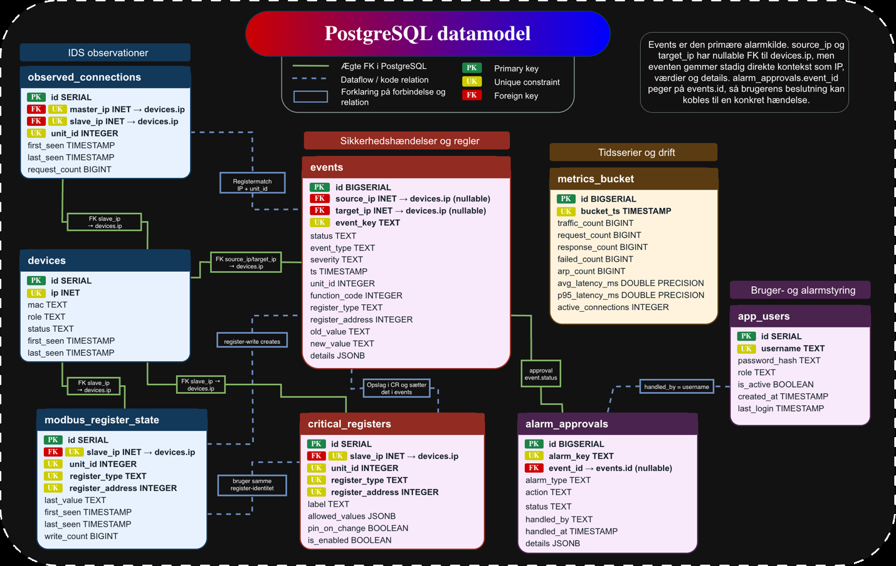
</p>

---

## Teknologistak

### Backend

- Python 3.11
- Flask
- Scapy
- psycopg2
- PostgreSQL
- SNMP-værktøjer
- Linux-netværksværktøjer

### Frontend

- Python 3.11
- Flask
- Gunicorn
- Flask-Limiter
- Redis-baseret rate limiting
- HTML/CSS/JavaScript
- Chart.js

### Infrastruktur

- Docker Compose
- PostgreSQL 16 Alpine
- Redis 7 Alpine
- Docker secrets
- Host networking til backend capture
- Linux capabilities: `NET_ADMIN` og `NET_RAW`

---

## Repository-struktur

```text
.
├── compose.yml
├── README.md
├── services
│   ├── backend
│   │   ├── Dockerfile
│   │   ├── requirements.txt
│   │   └── app
│   │       ├── main.py
│   │       ├── capture.py
│   │       ├── db.py
│   │       ├── config.py
│   │       ├── switch_monitor.py
│   │       ├── users_bootstrap.py
│   │       ├── api
│   │       ├── dashboard
│   │       ├── packet_parser
│   │       ├── state
│   │       └── storage
│   ├── db
│   │   └── init
│   │       └── 01_schema.sql
│   └── frontend
│       ├── Dockerfile
│       ├── requirements.txt
│       └── app
│           ├── main.py
│           ├── templates
│           └── static
├── docs
│   └── images
├── secrets
└── data
```

Vigtige backendmoduler:

| Modul | Ansvar |
| --- | --- |
| `capture.py` | Konfigurerer capture-interface og starter Scapy sniffing |
| `packet_parser/` | Parser ARP-, IP-, TCP-, MBAP- og Modbus-felter |
| `state/manager.py` | Koordinerer runtime-state, learning mode og detektionsflow |
| `state/devices.py` | Tracker devices, MAC-ændringer og rolleændringer |
| `state/connections.py` | Tracker master/slave/unit-relationer |
| `state/registers.py` | Tracker register writes og kritiske registerændringer |
| `state/requests.py` | Matcher requests/responses og detekterer latency, timeouts og exceptions |
| `state/metrics.py` | Bygger aggregerede metrics buckets |
| `storage/` | Skriver og læser PostgreSQL-data |
| `dashboard/` | Bygger API-klar dashboarddata |
| `switch_monitor.py` | Læser switch-port og MAC-mapping via SNMP |

---

## Krav

Anbefalet runtime-miljø:

- Linux host
- Docker Engine
- Docker Compose plugin
- Adgang til det monitorerede netværksinterface
- Mirrored/SPAN-trafik eller tilsvarende passiv tap
- Rettighed til at køre containere med `NET_ADMIN` og `NET_RAW`
- PostgreSQL og Redis startet via Docker Compose
- Valgfrit: SNMP-adgang til Westermo eller kompatibel managed switch

Til reel OT-test bør backenden køre på en Linux-maskine, der er forbundet til en mirrored switch-port. Docker Desktop på macOS eller Windows er ikke egnet til pålidelig raw capture fra et eksternt OT-interface.

---

## Hurtig start

### 1. Clone repository

```bash
git clone https://github.com/MagnusMadsen/Modbus_aware_firewall.git
cd Modbus_aware_firewall
```

### 2. Opret nødvendige mapper

```bash
mkdir -p secrets \
  data/postgres \
  data/redis \
  data/logs/backend \
  data/logs/frontend \
  data/pcap
```

### 3. Opret `.env`

Opret en `.env`-fil i repository-root:

```env
APP_ENV=development
TZ=Europe/Copenhagen

POSTGRES_DB=modbus_fw
POSTGRES_USER=modbus

APP_USERNAME=admin
APP_USER_ROLE=admin

REDIS_HOST=redis
REDIS_PORT=6379

FRONTEND_PORT=5000
API_BASE_URL=http://host.docker.internal:8000

CAPTURE_INTERFACE=eth0
SWITCH_INTERFACE=
SWITCH_INTERFACE_IP=192.168.61.250/24

SWITCH_IP=192.168.61.162
SNMP_VERSION=2c

LEARNING_WINDOW_SECONDS=300
REQUEST_TIMEOUT_SECONDS=10.0
LATENCY_SPIKE_MS=1000.0
```

Tilpas `CAPTURE_INTERFACE`, `SWITCH_IP` og `SWITCH_INTERFACE_IP` til det lokale OT-lab.

### 4. Opret Docker secrets

```bash
openssl rand -base64 32 > secrets/postgres_password.txt
openssl rand -hex 32 > secrets/backend_api_token.txt
openssl rand -hex 32 > secrets/frontend_secret_key.txt
printf "public\n" > secrets/snmp_community.txt
```

Opret dashboardets password hash. Udskift `change-this-password` før brug.

```bash
docker run --rm python:3.11-slim sh -c \
  "pip install Werkzeug >/dev/null && python -c 'from werkzeug.security import generate_password_hash; print(generate_password_hash(\"change-this-password\"))'" \
  > secrets/frontend_password_hash.txt
```

### 5. Start PostgreSQL og Redis

```bash
docker compose up -d postgres redis
```

### 6. Bootstrap første dashboardbruger

```bash
docker compose run --rm backend python app/users_bootstrap.py
```

Dette opretter brugeren defineret i `APP_USERNAME` med rollen fra `APP_USER_ROLE` og password-hashen fra `secrets/frontend_password_hash.txt`.

### 7. Start hele stacken

```bash
docker compose up --build -d
```

### 8. Åbn dashboardet

```text
http://localhost:5000
```

Log ind med brugernavnet fra `.env` og det password, der blev brugt ved generering af `frontend_password_hash.txt`.

---

## Konfiguration

### Primære environment variables

| Variable | Default/eksempel | Formål |
| --- | --- | --- |
| `APP_ENV` | `development` | Runtime-mode; påvirker secure cookie-adfærd |
| `TZ` | `Europe/Copenhagen` | Containerens timezone |
| `POSTGRES_DB` | `modbus_fw` | PostgreSQL-databasenavn |
| `POSTGRES_USER` | `modbus` | PostgreSQL-brugernavn |
| `APP_USERNAME` | `admin` | Første dashboardbruger oprettet af bootstrap-scriptet |
| `APP_USER_ROLE` | `admin` | Rolle for første bruger: `admin` eller `operator` |
| `FRONTEND_PORT` | `5000` | Host-port til webdashboard |
| `API_BASE_URL` | `http://host.docker.internal:8000` | Frontend-til-backend API URL |
| `CAPTURE_INTERFACE` | `eth0` | Interface brugt til passiv packet capture |
| `SWITCH_INTERFACE` | tom | Valgfrit management-interface, der kan konfigureres |
| `SWITCH_INTERFACE_IP` | `192.168.61.250/24` | IP tildelt switch-management-interface |
| `SWITCH_IP` | `192.168.61.162` | Managed switch-IP til SNMP-queries |
| `SNMP_VERSION` | `2c` | SNMP-version brugt af `snmpwalk` |
| `LEARNING_WINDOW_SECONDS` | `300` | Baseline learning-periode efter startup |
| `REQUEST_TIMEOUT_SECONDS` | `10.0` | Tid før en request vurderes som timed out |
| `LATENCY_SPIKE_MS` | `1000.0` | Latency-grænse for spike-events |

### Krævede secret-filer

| Secret-fil | Formål |
| --- | --- |
| `secrets/postgres_password.txt` | PostgreSQL-password |
| `secrets/backend_api_token.txt` | Delt token mellem frontend og backend API |
| `secrets/frontend_secret_key.txt` | Flask session signing key |
| `secrets/frontend_password_hash.txt` | Password hash til dashboardbruger-bootstrap |
| `secrets/snmp_community.txt` | SNMP community string |

---

## Dashboard

Dashboardet giver et live operationelt overblik over det monitorerede Modbus TCP-miljø.

Primære sektioner:

- sensorstatus og capture-interface
- summary cards for observerede enheder, request count og latency
- kombineret traffic- og latencygraf
- baseline- og thresholdvisualisering
- event markers på grafen
- alarm approval-log
- ARP detection-panel
- master/slave connection-overblik
- seneste IDS-events
- Westermo switch-portoverblik
- critical register configuration modal

Frontenden opdaterer live dashboarddata gennem endpointet `/api/live-dashboard` og proxier requests til backend API’et.

<p align="center">
  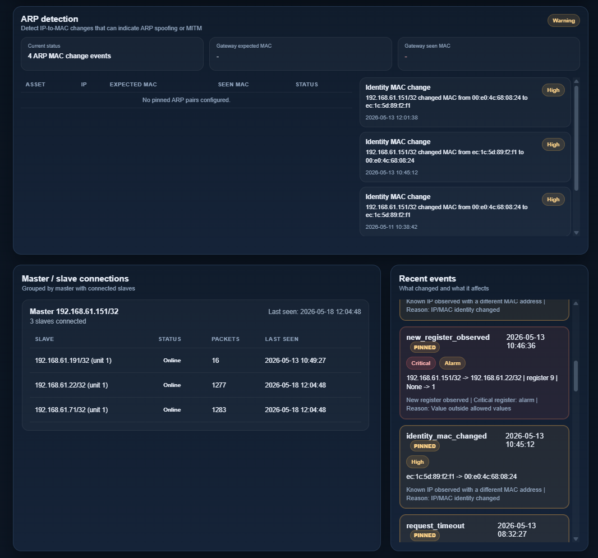
</p>

---

## API-overblik

Backend API endpoints:

| Method | Endpoint | Formål |
| --- | --- | --- |
| `GET` | `/health` | Backend healthcheck |
| `GET` | `/api/dashboard` | Samlet dashboard summary |
| `GET` | `/api/devices` | Observerede devices |
| `POST` | `/api/devices/<id>/<action>` | Approve, block eller ignore device |
| `GET` | `/api/alarm-approvals` | Liste over alarm approvals |
| `GET` | `/api/approved-alarm-keys` | Liste over håndterede alarm keys |
| `POST` | `/api/alarm-approvals` | Gem operatørbeslutning på en alarm |
| `GET` | `/api/users` | Liste over dashboardbrugere |
| `POST` | `/api/users` | Opret eller opdater dashboardbruger |
| `POST` | `/api/auth/login` | Valider dashboardlogin |
| `GET` | `/api/critical-registers` | Liste over kritiske registerregler |
| `POST` | `/api/critical-registers` | Opret eller opdater kritisk registerregel |
| `DELETE` | `/api/critical-registers/<id>` | Slet kritisk registerregel |

De fleste backend API-routes kræver `X-API-Token` headeren.

Frontend routes:

| Method | Endpoint | Formål |
| --- | --- | --- |
| `GET` | `/login` | Login-side |
| `POST` | `/login` | Send login |
| `GET` | `/logout` | Ryd session |
| `GET` | `/` | Dashboard |
| `GET` | `/api/live-dashboard` | Browser refresh endpoint |
| `GET/POST` | `/api/alarm-approvals` | Frontend-proxy for alarm approvals |
| `GET/POST/DELETE` | `/api/critical-registers` | Frontend-proxy for kritiske registerregler |
| `POST` | `/api/devices/<id>/approve` | Godkend device |
| `POST` | `/api/devices/<id>/block` | Marker device som blocked i databasen |
| `POST` | `/api/devices/<id>/ignore` | Ignorer device-alarm |

---

## Driftsnoter

### Capture-interface

Backenden aktiverer capture-interfacet og sætter det i promiscuous mode. Det valgte interface skal modtage spejlet OT-trafik, ellers viser dashboardet kun trafik, som hosten selv kan se.

Tjek tilgængelige interfaces:

```bash
ip link show
```

Tjek om Modbus-trafik er synlig:

```bash
sudo tcpdump -i eth0 -n 'arp or tcp port 502'
```

Udskift `eth0` med det konfigurerede `CAPTURE_INTERFACE`.

### Logs

```bash
docker compose logs -f backend
docker compose logs -f frontend
docker compose logs -f postgres
docker compose logs -f redis
```

### Databaseadgang

```bash
docker compose exec postgres psql -U "$POSTGRES_USER" -d "$POSTGRES_DB"
```

Nyttige checks:

```sql
SELECT * FROM devices ORDER BY last_seen DESC;
SELECT * FROM observed_connections ORDER BY last_seen DESC;
SELECT * FROM events ORDER BY ts DESC LIMIT 20;
SELECT * FROM alarm_approvals ORDER BY handled_at DESC;
SELECT * FROM metrics_bucket ORDER BY bucket_ts DESC LIMIT 20;
```

---

## Sikkerhedsnoter

Projektet indeholder flere grundlæggende sikkerhedskontroller:

- backend API-token mellem frontend og backend
- password hashes i stedet for plaintext dashboardpasswords
- Docker secrets til følsomme værdier
- frontend session cookie-indstillinger
- login rate limiting via Flask-Limiter og Redis
- PostgreSQL constraints for status, rolle, severity, function code og register ranges
- parameteriserede SQL-queries i storage-laget
- frontend-containeren kører som non-root user

Vigtige deployment-noter:

- Eksponer ikke dashboardet direkte mod upålidelige netværk.
- Udskift alle genererede secrets før brug uden for lab.
- Brug et stærkt dashboardpassword.
- Behandl SNMP community strings som credentials.
- Brug helst et dedikeret management-netværk til switch-SNMP-adgang.
- Placer dashboardet bag VPN eller et andet betroet adgangslag, hvis det bruges uden for et lokalt lab.
- Den nuværende Docker Compose-opsætning terminerer ikke TLS.

---

## Kendte begrænsninger

- Det nuværende system er passivt. Det håndhæver ikke inline packet blocking.
- Alarmhandlinger som `block` gemmes som operatørbeslutninger, men anvendes ikke aktivt i netværksstien.
- Detektion afhænger af trafiksynlighed. Hvis hosten ikke kan se spejlet Modbus-trafik, kan backenden ikke analysere den.
- Parseren fokuserer på udvalgte almindelige Modbus function codes.
- Systemet dekrypterer ikke trafik. Det er tiltænkt Modbus TCP, som normalt anvendes uden protokolkryptering.
- SNMP switch-mapping forudsætter kompatibelt IF-MIB/Q-BRIDGE-output og fysiske porte navngivet som `eth1`, `eth2` osv.
- Rå pakker gemmes ikke i PostgreSQL som standard.
- Dette er en fokuseret prototype og ikke en certificeret industriel sikkerhedsappliance.

---

## Fejlsøgning

### Dashboardet viser ingen trafik

Verificer at capture-interfacet er korrekt:

```bash
ip link show
```

Verificer at interfacet kan se ARP eller Modbus TCP:

```bash
sudo tcpdump -i eth0 -n 'arp or tcp port 502'
```

Tjek derefter backend logs:

```bash
docker compose logs -f backend
```

### Backend kan ikke sniffe pakker

Packet capture kræver raw socket-rettigheder. Compose-filen giver:

```yaml
cap_add:
  - NET_ADMIN
  - NET_RAW
```

Kør stacken på Linux og sørg for, at Docker har adgang til det fysiske interface.

### Login fejler

Gendan password hash og bootstrap bruger:

```bash
docker run --rm python:3.11-slim sh -c \
  "pip install Werkzeug >/dev/null && python -c 'from werkzeug.security import generate_password_hash; print(generate_password_hash(\"new-password\"))'" \
  > secrets/frontend_password_hash.txt

docker compose run --rm backend python app/users_bootstrap.py
```

Hvis brugeren allerede findes, overskriver bootstrap-scriptet den ikke. Opdater brugeren i databasen eller opret et nyt brugernavn i `.env`.

### SNMP switch-sektionen viser fejl

Tjek:

- `SWITCH_IP`
- `SNMP_VERSION`
- `secrets/snmp_community.txt`
- netværksforbindelse fra backend host
- om switchen tillader SNMP fra monitoreringshosten

Manuel test:

```bash
snmpwalk -v2c -c public 192.168.61.162 1.3.6.1.2.1.2.2.1.2
```

Udskift community og IP med de konfigurerede værdier.

### Git melder permission errors i `data/postgres`

PostgreSQL-containerfiler kan være ejet af containerbrugeren. Commit ikke indholdet i `data/`. Hold runtime-data ude af versionsstyring.

---

## Roadmap

Mulige fremtidige forbedringer:

- inline enforcement mode for udvalgte policies
- dedikeret allowlist-policy for godkendte masters, slaves og function codes
- eksportbare eventrapporter
- PCAP export for udvalgte events
- TLS/reverse proxy deployment-profil
- role-based frontend authorization enforcement
- automatiserede tests for parser og detektionslogik
- konfigurerbare thresholds fra dashboardet
- bredere Modbus function-code decoding
- persistente baseline-profiler i stedet for startup-only learning mode

---

## Licens

Dette projekt er licenseret under MIT License. Se [LICENSE](LICENSE) for detaljer.

